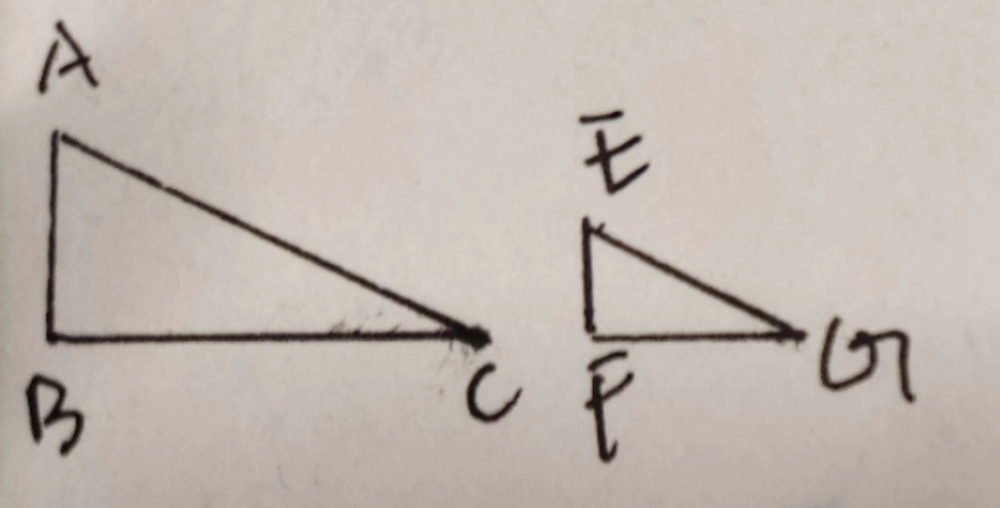
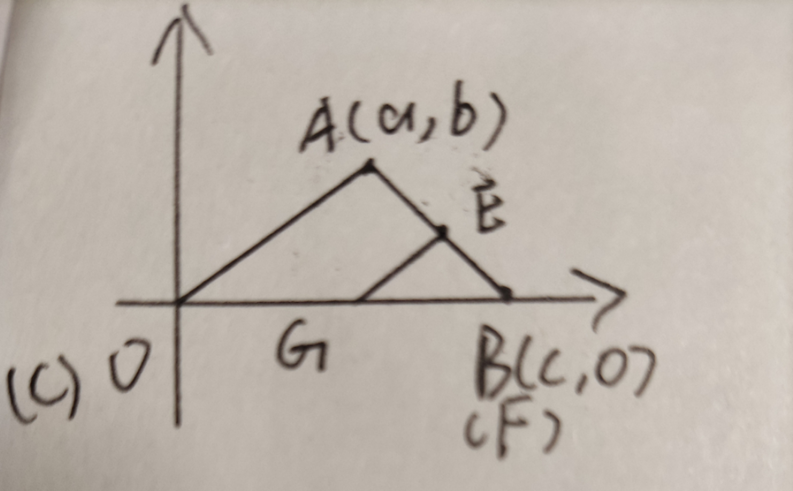

# 相似三角形

## 定义

一般的我们说 $\triangle ABC \sim \triangle EFG$
当且仅当 $\triangle ABC$与 $\triangle EFG$成比例

### 例子1

若 $\displaystyle \frac{AB}{EF} = \frac{BC}{FG} = \frac{AC}{FG}$
则 $\triangle ABC \sim \triangle EFG$

解：通过定义这是显然的

### 例子2

如果 $\triangle ABC \cong \triangle EFG$那么 $\triangle ABC \sim \triangle EFG$

解：通过全等的条件，不难看出这题是上一题的特例，即
$$\displaystyle \frac{AB}{EF} = \frac{BC}{FG} = \frac{AC}{FG} = 1$$

## 判定

### 定理1

如果 $\triangle ABC$和 $\triangle EFG$对应角相等
那么 $\triangle ABC \sim \triangle EFG$

证：不妨设 $\triangle ABC$面积大于 $\triangle EFG$
我们以 $\triangle ABC$某个锐角的顶点为原点，某一边延长为 $x$轴建系(这里假设为$CB$)
设 $A(a,b)$，$B(c,0)$

由于 $\triangle ABC$和 $\triangle EFG$对应角相等，
我们可以将 $\triangle EFG$放入 $\triangle ABC$内
使 $F$与 $B$重合，使 $EG\mathop{//}AO$

计算 $AO$所在直线的解析式为
$$y = \frac{b}{a}x$$
因为 $EG\mathop{//}AO$所以$EG$所在直线解析式可以设为($k$为常数)
$$y = \frac{b}{a}x + k$$
计算 $AB$所在直线解析式为
$$y = \frac{b}{a-c}x + \frac{ac}{c-a}$$
计算 $E,G$坐标为
